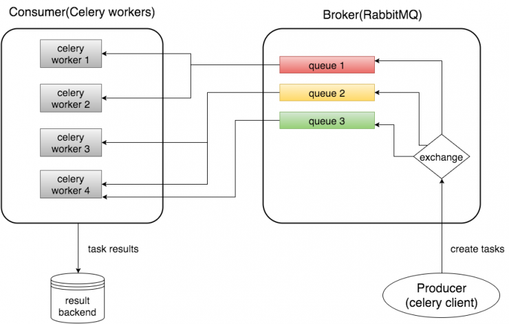

A Scalable Web Crawling Prototype

Web crawlers are technologies used to map the internet, typically for academic or business purposes. The most primitive versions in the 1990s ran on single machines looping through IP addresses and extracting basic metadata, to provide users with a searchable directory, but since then a combination of exponential internet growth and commercial competition has driven the sophistication of crawlers to eyewatering heights. A considerable challenge for these technologies is how to filter and interpret the data which is not a problem at all addressed by this prototype, rather this is here to demonstrate a simple but scalable architecture for making large numbers of connections using a single machine or cluster.

## Architecture
We want to crawl large volumes of pages independently, so to minimise waiting this software uses multi-threading. Since the goal of this prototype is to provide a scalable architecture I chose to use the [celery task manager](http://www.celeryproject.org/), rather than using the builtin thread library, as with celery we can run distributed instances of a concurrent task-managers known as a 'worker', and use a centralised messaging-server ('broker') to serve instructions to workers.



Celery requires a broker and there are several options available, but I opted for [RabbitMQ](https://www.rabbitmq.com) because it is well-documented, open-source and stable.

To simulate some typical crawling operations the workers are instructed to extract all the internal links from the home page and store it in a [Mongo ](https://www.mongodb.com/) database. A python script known as a 'task-list' reads through (a subset) of the Alexa top 1 million visisted URLs and sends crawling instructions to the message broker.

The task-list, broker, workers and database all run in docker containers and are hooked together using a docker-compose that provides a convenient development environment, easy network configuration and the ability to scale up and manage this crawler over a swarm.

## Mock crawling task
To test this system I wrote a procedure to read a robots.txt, then while respecting the rules download and parse the HTML, and record the HTTP  request status of the internal links. For politeness the script leaves 1s between each request on a particular domain.

Originally I wanted to scan links down to a particular depth but this requires quite a bit of extra complexity without much gain, as this is just a mock task.

There are also some issues with the way the system reads robots.txt. The 
builtin urllib library includes a robots parser but I found that this failed to read google.com/robots.txt due to an encoding error, so didn't have much faith in it. The class I wrote just reads the file once and parses it with regular expressions into a dictionary. After initialisation an instance can be queried with a URL string to see if it can be crawled. Needless to say it is still quite a crude implementation that does not account for the non-standard '*' wildcards that are used in many robots.txt files.

> Note also that globbing and regular expression are not supported in either the User-agent or Disallow lines. The '*' in the User-agent field is a special value meaning "any robot". Specifically, you cannot have lines like "User-agent: *bot*", "Disallow: /tmp/*" or "Disallow: *.gif". 

*Taken from the [robots.txt standard](http://www.robotstxt.org/robotstxt.html)*

Another issue is how internal and external links are identified. The procedure discards empty links or those that have '#', and tries to filter external links by searching for 'http://' or 'https://' in the link but this is far from perfect as it identifies en.wikipedia.org as an internal link and tries to connect to 'http://www.wikipedia.org/en.wikipedia.org'. To properly overcome this is quite difficult as a path can be, relative such as `index.html` which should resolve to http://baseurl/index.html or external such as `external.org` that should resolve to http://external.org. Solving these issues is outside the intended scope of this project.

## How to use
This does not yet work with the docker stack because I have not found how to give the broker and mongo servers names that are resolved by the network, but with docker-compose it works. Fetch the files from this repository and execute:

`docker-compose build`
`docker-compose up`

The number of threads in a single worker can be changed by modifying the `$CONCURRENCY` variable in 'docker-compose.yml', under 'worker'

```
environment:                                                                                                                                       
    - CONCURRENCY=100
```

and the number of pages read can be changed by modifying the `$NUMPAGES` variable, under 'tasklist'
```
environment:                                                                                                                                       
    - NUMPAGES=10000 
```

N workers can be deployed by running
`docker-compose up --scale workers=N`

The status of the broker can be monitored from a browser by navigating to

`localhost:5673`

and the mongo database can be accessed by directing the GUI to
`localhost:27018`

These services have been mapped to these non-standard ports to avoid conflicts on the host machine.

## Going forward

This project provides a web crawling prototype that is capable of beyond deployed on a single-machine, in a cluster or on cloud and scaled up accordingly. The modular container-based framework makes it possible to add extra features such as load-balancing.

The procedure implemented for this crawler is not particularly useful by itself, but could be transformed into a useful application by modifying the task, all you would need to change is the function `task_manager.tasks.crawl_site`.
